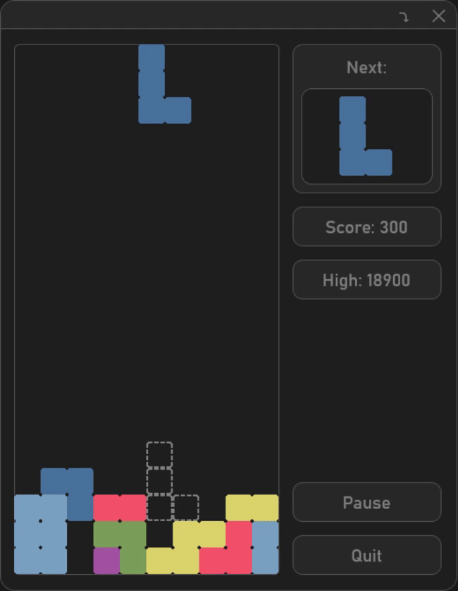

# Tetris: DirectX Edition

A classic Tetris clone built on raw WinAPI + Direct3D11 + Direct2D + DirectComposition.

---

<p align="center">
  
</p>

---

## Features

- **Direct2D & DirectComposition Rendering**: hardware-accelerated rendering with D3D11 + D2D1 + DComposition
- **Classic Gameplay**: move(←/→), rotate(↑), soft‑drop(↓) and hard‑drop(Space) 
- **Ghost Piece**: shows where the current piece will land
- **Smooth Animations** for piece movement  
- **VSync‑capped FPS** via `IDXGISwapChain::Present(1, 0)`

---

## Requirements

- Windows 10+  
- Visual Studio 2019/2022 or any C++17‑capable compiler  
- DirectX 11 (D3D11, Direct2D, DirectWrite, DirectComposition)  
- CMake ≥ 3.16  

---

## Build Instructions

```bash
git clone https://github.com/avg-cpp-enjoyer/DirectX-Tetris-Game.git
mkdir build && cd build
cmake ..
cmake --build . --config Release
```

---

## License

MIT © Daniil Frolov
